# Rebuild 1 Prototypes

A collection of the public prototypes built during 48 hours for European social platforms at Rebuild 1 in Copenhagen, March 1st–3rd, 2026. The prototypes were developed primarily with Lovable, under the direction of initiative lead Mads Damsbo.

---

## OFF

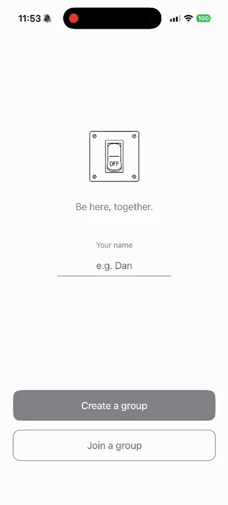

*Put your phone down. Let's talk.*

A social coordination app that inverts the usual dynamic: instead of pulling you in, it asks you to switch off together. Groups create a shared session and commit to being physically present — phones down, conversation on.

---

## CitizenLens

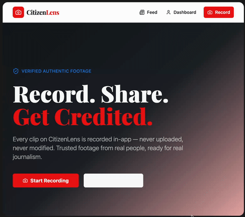

[Live preview](#)

*Eyewitness videosharing for EU citizens and journalists.*

CitizenLens lets citizens record and share video directly in-app — footage is never uploaded from camera rolls, never modified after capture — creating a verifiable chain of custody. Journalists can browse, filter, and use verified clips with built-in attribution.

[GitHub repository](https://github.com/rebuild-europe/eye-witness)

---

## Tide Shift

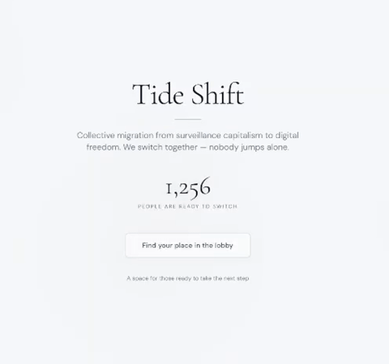

*Collective migration from surveillance capitalism to digital freedom.*

Tide Shift solves the hardest problem in platform switching: nobody wants to be the first to leave. It uses a lobby-based coordination mechanic — users pledge to switch, and the migration only happens when a critical mass is ready. Nobody jumps alone.

[GitHub repository](https://github.com/rebuild-europe/euro-safe-switch)

---

## Orbit

[Live preview](#)

*Discover people around you instantly.*

Orbit shows you who is physically nearby — within a configurable 10–50 metre radius — with names, avatars, and a short bio. A "Discover Mode" toggle gives full user control. The spatial map view makes serendipitous connection feel natural rather than intrusive.

[GitHub repository](https://github.com/rebuild-europe/orbit-rebuild)

---

## Homebase

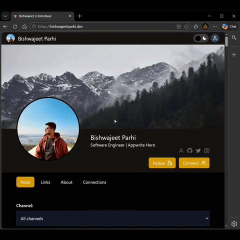

[Live preview](#)

*App platform for building self-sovereign, secure, decentralized social applications.*

Homebase is a self-hosted identity and content layer. Users own their data (via Appwrite or similar backends), choose which social apps to connect, and carry their profile and posts across services. The demo shows a polished profile with Posts, Links, About, and Connections — all portable.

[GitHub repository](https://github.com/rebuild-europe/homebase.id)

---

## The Forest

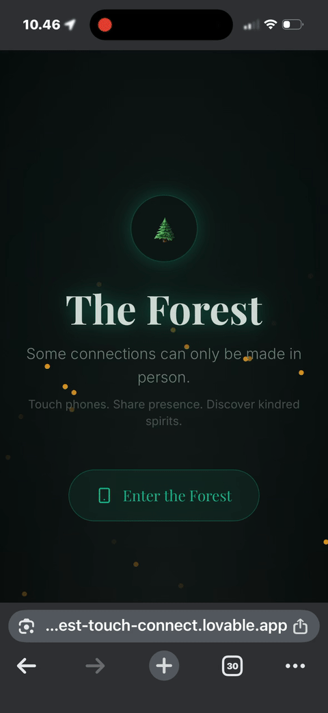

[Live preview](#)

*Connect physically before digitally.*

The Forest requires you to touch phones with someone in person before a digital connection is made. Some connections can only be made in person — touch phones, share presence, discover kindred spirits. The app creates a gentle, atmospheric onboarding around the physical act of meeting.

[GitHub repository](https://github.com/rebuild-europe/forest-touch-connect)

---

## Personal Digest

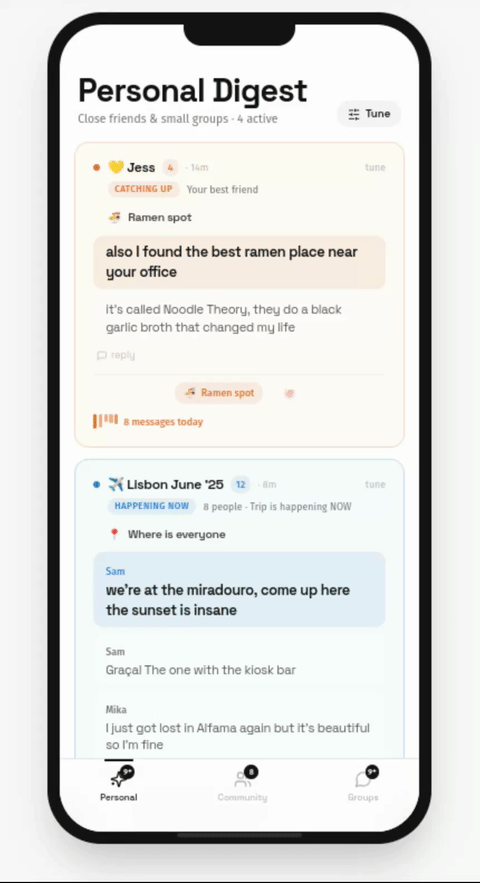

[Live preview](#)

*Groups tuned by prominence to control how they rank in your feed.*

Personal Digest replaces the algorithmic feed with a user-controlled one. Each group or contact can be tuned for prominence — close friends loud, large communities quiet — resulting in a digest that reflects your actual priorities rather than an engagement-maximizing algorithm's.

---

## Kirsten

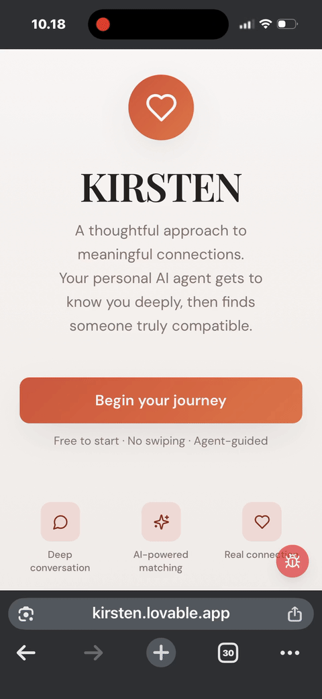

[Live preview](#)

*AI mediated matchmaking and relationship coach.*

Kirsten is a voice-first AI agent that gets to know you through a warm, natural conversation — building your relationship profile without forms or questionnaires. The voice interface surfaces personality, communication style, and emotional intelligence in ways that text profiles cannot.

[GitHub repository](https://github.com/rebuild-europe/kirsten)

---

## Wisdom Panel

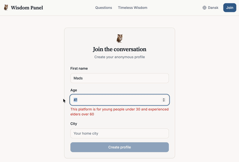

[Live preview](#)

*Where generations meet.*

Wisdom Panel is a structured intergenerational exchange: young people ask life's big questions, and experienced elders answer. The interface is deliberately minimal — no likes, no followers, just questions and responses, organized by newest and most answered.

[GitHub repository](https://github.com/rebuild-europe/wisdompanel)

---

## The Self

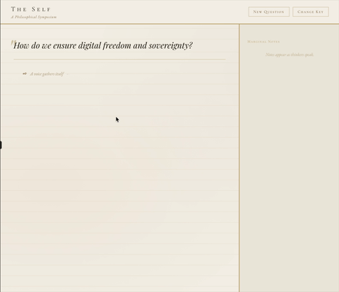

[Live preview](#)

*A resurrected symposium just for you.*

The Self is a philosophical AI symposium. You pose a question, and a gathering of AI-voiced "thinkers" debates it in real time — with marginal notes appearing alongside as the conversation develops. The aesthetic is parchment, classical typography, and genuine intellectual weight.

---

## Simple Meet

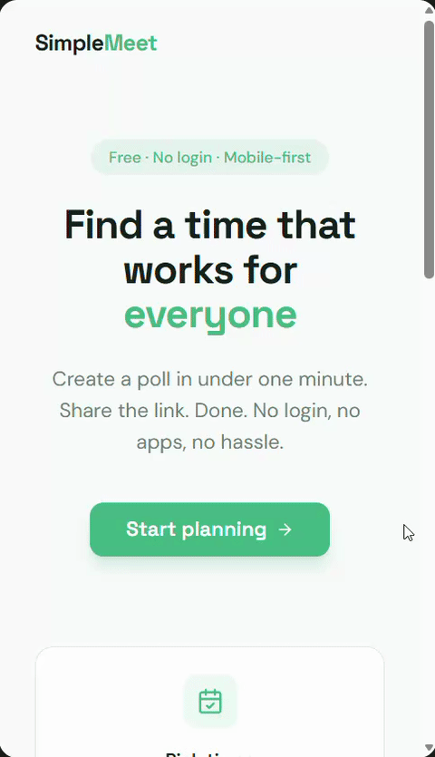

[Live preview](#)

*The doodle that actually works.*

Simple Meet creates a scheduling poll in under a minute — no login, no app download, mobile-first. Share the link, people mark their availability, done. It strips group scheduling back to the absolute minimum required to get a time agreed.

[GitHub repository](https://github.com/rebuild-europe/quickmeet-sync)

---

## The Concierge

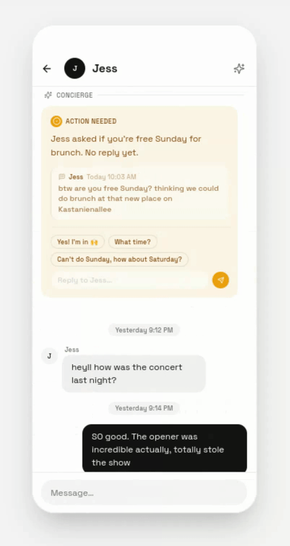

[Live preview](#)

*A concierge layer for group messaging.*

The Concierge sits above your message threads and tells you what actually needs your attention. Across groups of any size — from a best friend to a 1,043-member community — it surfaces unanswered questions, missed polls, pending decisions, and active threads, so you never have to scroll to catch up.

---

## Sovereignty Planner

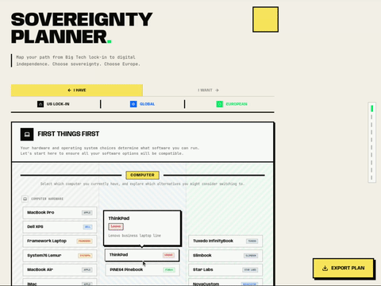

[Live preview](#)

*Map your path away from big tech.*

Sovereignty Planner is a step-by-step migration guide from Big Tech lock-in to digital independence. Starting with hardware (because your device determines which OS and software you can run), it walks you through replacements for every layer of your digital life, with a filterable view across US lock-in, global, and European alternatives. Plans are exportable.

---

## DOGMAs

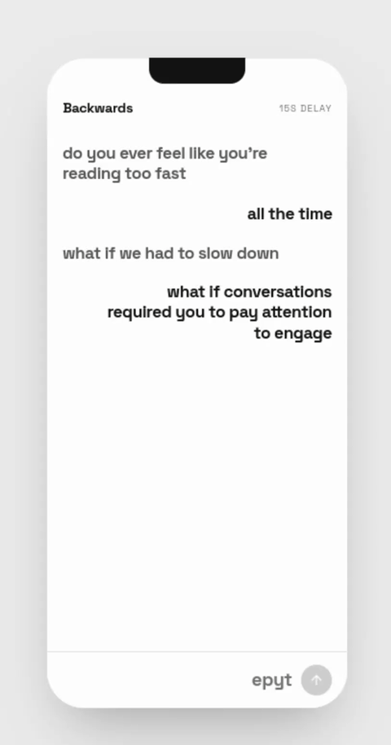

[Live preview](#)

*Friction dogma #1: backwards typing.*

DOGMAs is a platform built around designed friction. The first dogma: you type your messages backwards — the letters appear in reverse as you write — and are displayed forwards to the recipient. A 15-second send delay adds a further pause for reflection. The result: slower, more intentional communication.

---

## Commons

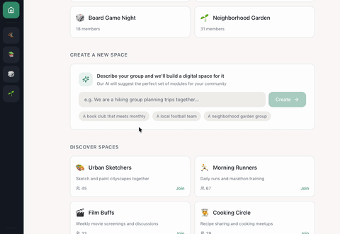

[Live preview](#)

*Vibecoded community platform.*

Commons lets you describe your community in plain language and builds the right digital space for it. "We are a hiking group that plans trips together" generates a tailored set of modules — event planning, discussion, photo sharing — without manual configuration. Your existing spaces are shown as a dashboard of named communities.

[GitHub repository](https://github.com/rebuild-europe/welcometocommons)

---

## Local Sports Finder

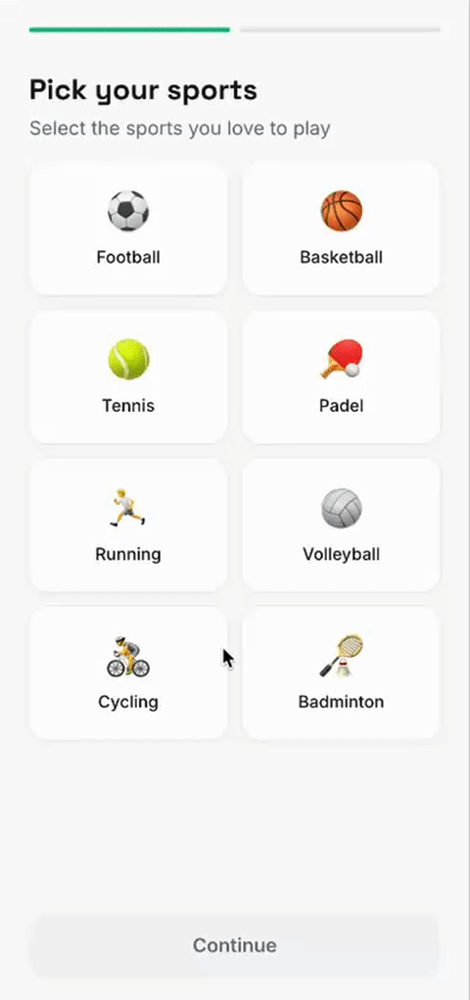

[Live preview](#)

*Pick up a game anywhere near you.*

Local Sports Finder shows you informal games and pickup sessions happening nearby right now. You select the sports you play in onboarding, and the app surfaces opportunities to join — football, basketball, tennis, padel, cycling, and more — removing the coordination friction that stops spontaneous sport from happening.

[GitHub repository](https://github.com/rebuild-europe/locall-sports-finder)

---

## Craft

[Live preview](#)

*Share what you build.*

Craft is a maker-focused social platform for people who create physical things. Onboarding asks you to pick a primary hobby — DIY & Maker, Cooking & Baking, Photography, Painting & Art, Gardening, and more — and builds a personalized feed of made things around it. The emphasis is on the process and the object, not the creator's persona.

[GitHub repository](https://github.com/rebuild-europe/hobby-craft)

---

## Tool Pool

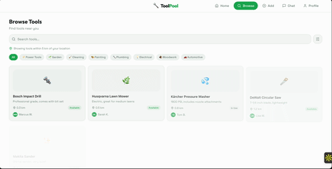

[Live preview](#)

*Find tools from neighbours. Reduce waste, save money, build together.*

Tool Pool is a hyperlocal tool lending network. An AI-powered search lets you describe what you need ("I need a drill for hanging shelves"), and the app surfaces tools available from nearby neighbours. Gamification (XP levels, "12 tools lent — keep going!") encourages lending, and community projects and repair workshops are surfaced alongside individual tools.

[GitHub repository](https://github.com/rebuild-europe/jointhetoolpool)
